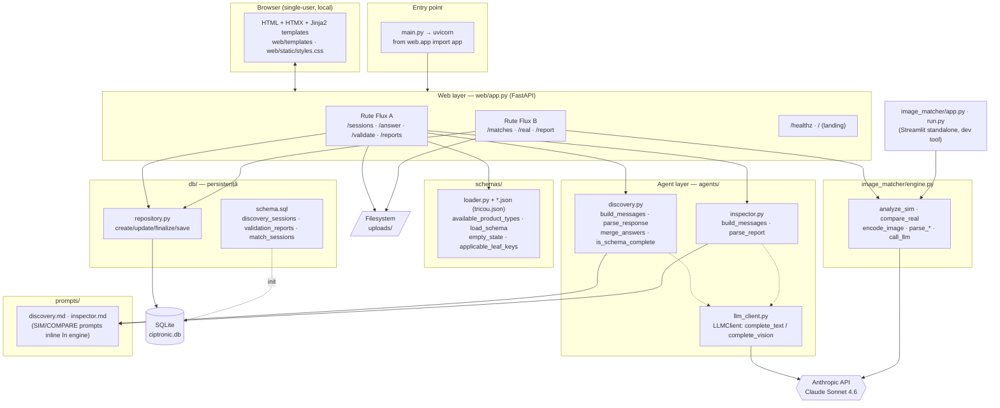

# Ciptronic Validator — Diagramă de arhitectură

Aplicație web locală (single-user) pe straturi: web subțire (FastAPI + HTMX) peste logica de domeniu din `agents/` (Flux A) și `image_matcher/engine.py` (Flux B), cu persistență SQLite și apeluri la Claude Sonnet 4.6.

## Diagramă Mermaid



## Diagramă ASCII

```
┌──────────────────────────────────────────────────────────────────────────┐
│  BROWSER (local, single-user)   HTML + HTMX + Jinja2 (web/templates)       │
└───────────────────────────────┬────────────────────────────────────────────┘
                                 │ HTTP
                    ┌────────────▼─────────────┐        main.py → uvicorn
                    │   WEB LAYER  web/app.py   │◄────── (from web.app import app)
                    │   FastAPI routes          │
                    │  ┌─────────────────────┐  │
                    │  │ Flux A: /sessions   │  │
                    │  │   /answer /validate │  │
                    │  │   /reports          │  │
                    │  ├─────────────────────┤  │
                    │  │ Flux B: /matches    │  │
                    │  │   /real /report     │  │
                    │  └─────────────────────┘  │
                    └──┬─────────┬─────────┬─────┘
          ┌────────────┘         │         └──────────────┐
          ▼                      ▼                        ▼
┌──────────────────┐   ┌──────────────────┐   ┌─────────────────────────┐
│ AGENTS (Flux A)  │   │ image_matcher/   │   │ schemas/loader.py        │
│ discovery.py     │   │ engine.py        │   │  + tricou.json           │
│ inspector.py     │   │ analyze_sim      │   │ load_schema/empty_state  │
│ llm_client.py    │   │ compare_real     │   └─────────────────────────┘
└───────┬──────────┘   └────────┬─────────┘
        │ prompts/               │  (prompts inline)         ┌───────────────┐
        │ discovery.md           │                           │ db/repository │
        │ inspector.md           │                           │  + schema.sql │
        ▼                        ▼                            └──────┬────────┘
   ┌─────────────────────────────────────┐                          │
   │   Anthropic API — Claude Sonnet 4.6  │                          ▼
   │   (complete_text / complete_vision)  │                  ┌───────────────┐
   └─────────────────────────────────────┘                  │ SQLite        │
                                                             │ ciptronic.db  │
   ┌─────────────────────────────────────┐                  │ • discovery_  │
   │  uploads/  (poze sim/real/validare)  │◄── Web layer     │   sessions    │
   └─────────────────────────────────────┘    scrie fișiere │ • validation_ │
                                                             │   reports     │
   ┌─────────────────────────────────────────┐              │ • match_      │
   │ image_matcher/app.py + run.py (Streamlit)│──► engine.py │   sessions    │
   │ dev tool standalone, separat de FastAPI  │              └───────────────┘
   └─────────────────────────────────────────┘
```

## Note de arhitectură

- **Strat web subțire:** `web/app.py` orchestrează, dar nu conține logică de domeniu — deleagă la `agents/` (Flux A) și `image_matcher/engine.py` (Flux B).
- **Două căi LLM diferite:** Flux A trece prin `LLMClient` (wrapper subțire, prompturi în `prompts/*.md`); Flux B are propriul `call_llm` în engine (cu retry + prompturi inline). Ambele lovesc același model Sonnet 4.6.
- **Funcții pure vs. I/O:** atât `agents/` cât și `engine.py` separă parsarea/validarea (testabile unit) de apelurile API (verificate manual).
- **Extensibilitate fără cod:** un tip de produs nou = doar un `schemas/<nume>.json`; `loader.py` îl ridică automat în dropdown.
- **Streamlit-ul rămâne separat:** `image_matcher/app.py` e un dev tool standalone care refolosește același `engine.py`, fără să atingă FastAPI sau DB-ul.
