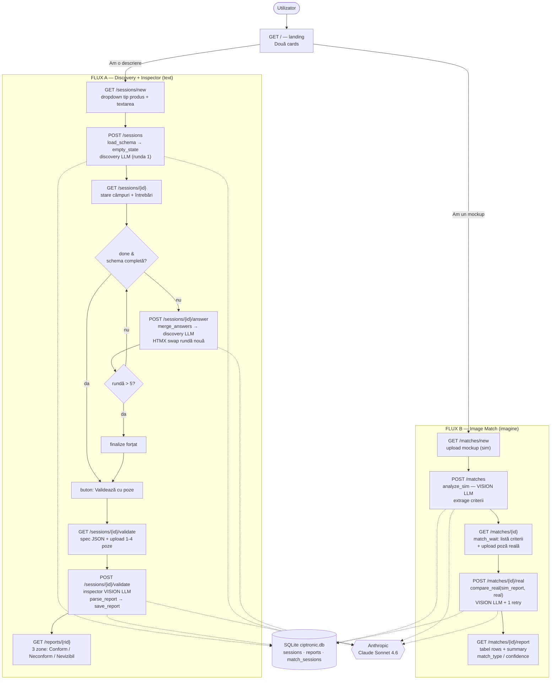

# Ciptronic Validator — Diagramă de flux

Aplicație web locală cu două fluxuri paralele, independente, ambele persistate în `ciptronic.db` și folosind Claude Sonnet 4.6 (text + vision).

## Diagramă Mermaid



## Diagramă ASCII (terminal)

```
                          ┌─────────────────────────┐
                          │   GET /  (landing page)  │
                          │   ┌───────┐  ┌────────┐  │
                          │   │descri-│  │ mockup │  │
                          │   │ ere   │  │        │  │
                          └───┴───┬───┴──┴───┬────┴──┘
              "Am o descriere"    │          │   "Am un mockup"
            ┌───────────────────◄─┘          └─►──────────────────┐
            ▼                                                      ▼
╔══════════════════════════════════╗          ╔══════════════════════════════════╗
║  FLUX A — Discovery + Inspector  ║          ║      FLUX B — Image Match        ║
╠══════════════════════════════════╣          ╠══════════════════════════════════╣
║ GET /sessions/new                ║          ║ GET /matches/new                 ║
║   dropdown tip + descriere       ║          ║   upload mockup (sim)            ║
║            │                     ║          ║            │                     ║
║            ▼                     ║          ║            ▼                     ║
║ POST /sessions                   ║          ║ POST /matches                    ║
║   schema → empty_state           ║          ║   analyze_sim()  [VISION LLM]    ║
║   discovery LLM  (runda 1)       ║          ║   → extrage criterii             ║
║            │                     ║          ║            │                     ║
║            ▼                     ║          ║            ▼                     ║
║ GET /sessions/{id}               ║          ║ GET /matches/{id}  (wait)        ║
║   stare câmpuri + întrebări      ║          ║   listă criterii + upload real   ║
║            │                     ║          ║            │                     ║
║      ┌─────┴──────┐              ║          ║            ▼                     ║
║   done & schema completă?        ║          ║ POST /matches/{id}/real          ║
║      │ nu       │ da             ║          ║   compare_real()  [VISION LLM]   ║
║      ▼          │                ║          ║   sim_report vs poză reală       ║
║ POST .../answer │                ║          ║   (+1 retry la parse fail)       ║
║  merge_answers  │                ║          ║            │                     ║
║  discovery LLM  │                ║          ║            ▼                     ║
║  (HTMX swap)    │                ║          ║ GET /matches/{id}/report         ║
║      │          │                ║          ║   tabel rows + summary           ║
║  runda > 5? ────┤ (finalize)     ║          ║   match_type / confidence        ║
║      └──►───────┤                ║          ╚══════════════════════════════════╝
║                 ▼                ║
║ GET .../validate                 ║
║   spec JSON + upload 1-4 poze    ║          ┌───────────────────────────────┐
║            │                     ║          │  SQLite  ciptronic.db         │
║            ▼                     ║   ◄──────│   • sessions                  │
║ POST .../validate                ║   toate  │   • reports                   │
║   inspector()  [VISION LLM]      ║   rutele │   • match_sessions            │
║   parse_report → save_report     ║   scriu  └───────────────────────────────┘
║            │                     ║
║            ▼                     ║          ┌───────────────────────────────┐
║ GET /reports/{rid}               ║   ◄──────│  Anthropic Claude Sonnet 4.6  │
║   Conform │ Neconform │ Nevizibil║   apeluri│  (text + vision)              │
╚══════════════════════════════════╝   LLM    └───────────────────────────────┘
```

## Pe scurt

- **Două fluxuri paralele** pornind din landing-ul `/`, complet independente, ambele persistate în `ciptronic.db`.
- **Flux A (text):** descriere vagă → întrebări iterative (max 5 runde, închidere forțată la a 5-a) → la `done` + schemă completă se trece la validarea cu 1–4 poze → raport pe trei zone (Conform / Neconform / Nevizibil).
- **Flux B (imagine):** mockup → `analyze_sim` extrage criteriile → poză reală → `compare_real` confruntă criteriu-cu-criteriu → tabel cu `match_type` și `confidence`.
- **Apeluri LLM:** runda de discovery și ambele apeluri vision (inspector, analyze_sim / compare_real) merg la Claude Sonnet 4.6; `compare_real` are un retry cu hint corectiv la eșec de parse.
